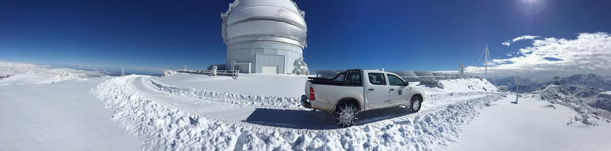

I am an astronomer, former staff at the [Gemini Observatory](https://www.gemini.edu/) in La Serena, Chile. Even before, I had postdoctoral positions at the same Gemini Observatory, [Michigan State University](https://pa.msu.edu/) and the [Finnish Centre for Astronomy with ESO](https://sites.utu.fi/finca/en/)

